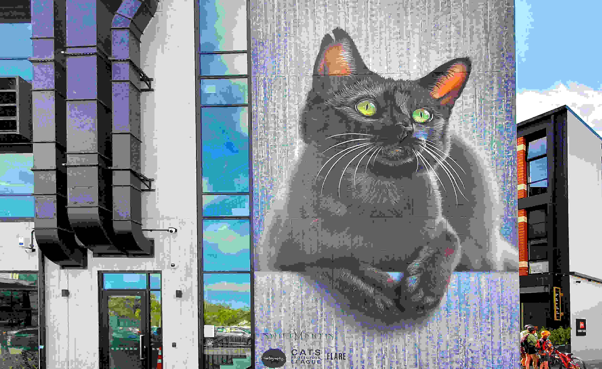

# embedded-iconoir - Icons for every device, ever.

## What is embedded-iconor?
`embedded-iconoir` is a library that allows you to use [Iconoir](https://github.com/iconoir-icons/iconoir)
on embedded devices , using Rust and the [`embedded-graphics` library](https://github.com/embedded-graphics/embedded-graphics).

## How many Icons?
All the over 1300 icons offered by [Iconoir](https://github.com/iconoir-icons/iconoir) are also supported in this library.
They are ordered by categories, so if you need a preview look at [the Iconoir Website](https://iconoir.com)
to pick out the exact icon you need.

### How much storage does this add to my app?
Not a lot, actually. Only icons that you actually use are included, and they are tiny.
Every pixel only takes a single bit, so each icon is `resolution^2 / 8` bytes in size.
For `24px` resolution, each icon is only 72 bytes. That means you could fit all 1300+ icons in `24px`
resolution into less than 100kb! That's more than 20% smaller than this extremely over-compressed 
image of a cat:

([Image Source](https://stocksnap.io/photo/street-art-7KZHK83LSQ))

## Usage

### Selecting a resolution

`embedded-iconoir` gives you feature flags for the available rendering resolutions:
`12px`, `18px`, `24px`, `32px`, `48px`, `96px` and `144px`.
You can also enable the `all-resolutions` feature to just get all of them, but note
that that will significantly increase your compile time.

### Using the icons

The icons are structured into modules by **size** and then **category**.
So, `icons::sizeXXpx::CATEGORY::CamelCaseIconName` is how you can select a specific
icon in a specific resolution.
If you're only using one resolution, it's a good idea to import `embedded_iconoir::icons::sizeXXpx::*` so
that you have direct access to all categories.

Here's an example:
```rust
fn main() -> anyhow::Result<()> {
    // init display

    let color = Rgb888::CSS_CYAN;

    // Color is specified during icon creation
    let mut icon_tiny = icons::size12px::development::CodeBracketsSquare::new(color);
    let mut icon_normal = icons::size24px::development::CodeBracketsSquare::new(color);
    let mut icon_large = icons::size48px::development::CodeBracketsSquare::new(color);
    let mut icon_huge = icons::size144px::development::CodeBracketsSquare::new(color);

    // Icons must be wrapped into images to draw them properly
    let image_tiny = Image::new(&icon_tiny, Point::new(10, 10));
    // ...

    image_tiny.draw(&mut display)?;
    // ...


    // Changing colors after creation:
    let mut idx = 0u8;
    let colorscheme = colorous::RAINBOW;

    loop {
        let Color { r, g, b } = colorscheme.eval_rational(idx as usize, u8::MAX as usize);
        let _ = idx.overflowing_add(1);

        // Colors can be changed dynamically during runtime
        icon_tiny.set_color(Rgb888::new(r, g, b));
        // ...

        // But the images need to be recreated each time, because of their reference to the icon
        let image_tiny = Image::new(&icon_tiny, Point::new(10, 10));
        // ...

        image_tiny.draw(&mut display)?;
        // ...
    }

    Ok(())
}
```
If you run this, you'll get something like this:


A complete version of this code can also be viewed in `tests/cover_example.rs`.

## Contributing

If you found a bug, or think that a feature is missing, please open an issue on [GitHub](https://github.com/yandrik/embedded-iconoir).
Of course, Pull Requests are also very much appreciated.
